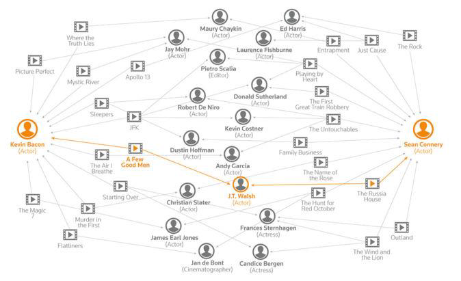
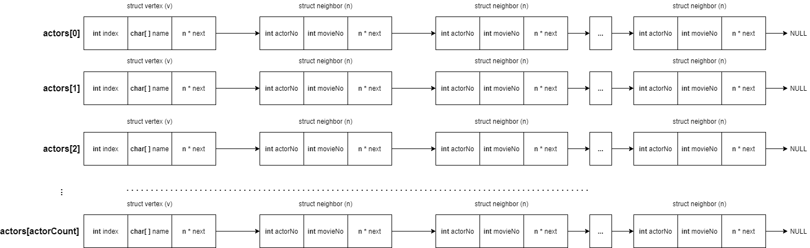
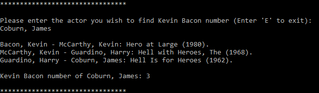
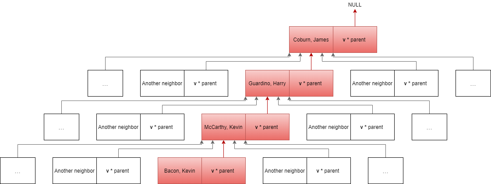
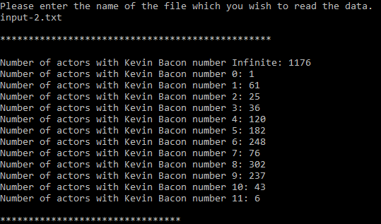
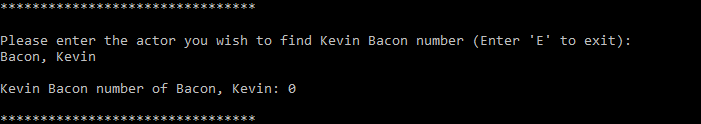
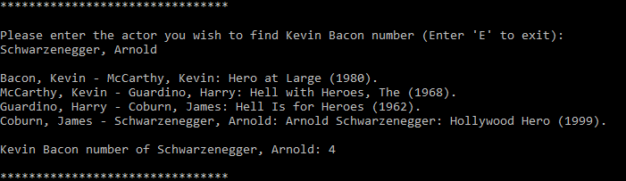
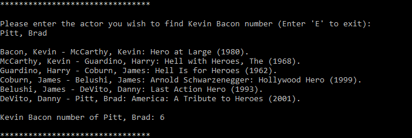
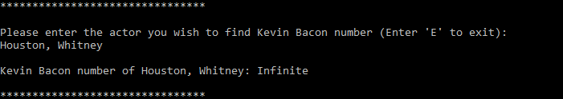
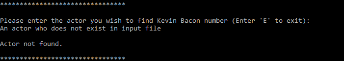

# Small World Phenomenon
* The program which finds the nearest relation between actors and Kevin Bacon (Kevin Bacon number of an actor) by reading from a file via Breadth First Search algorithm over a graph. It creates a graph which represents relations between actors. Two actor played in same movie means they are related to each other by the movie. Then, program finds every single actor's Kevin Bacon number by using Breadth First Search algorithm over the graph. 

### What is Small World Phenomenon
* The small-world experiment comprised several experiments conducted by Stanley Milgram and other researchers examining the average path length for social networks of people in the United States. The research was groundbreaking in that it suggested that human society is a small-world-type network characterized by short path-lengths. The experiments are often associated with the phrase "six degrees of separation", although Milgram did not use this term himself. In brief, this phenomenon suggests that every two person in the world, related to each other via people they know.

### What is Kevin Bacon Number
* The Bacon number of an actor or actress is the number of degrees of separation they have from actor Kevin Bacon, as defined by the game known as Six Degrees of Kevin Bacon.
* For example, Kevin Bacon's Bacon number is 0. If an actor works in a movie with Kevin Bacon, the actor's Bacon number is 1. If an actor works with an actor who worked with Kevin Bacon in a movie, the first actor's Bacon number is 2, and so forth.

### What Does Program Do
* Program asks user for an input file.
* Reads the data from user given input file and creates the graph by adjacency lists of actors.
* Calculates every single actor's Kevin Bacon number by Breadth First Search algorithm and prints number of actors with each Kevin Bacon number.
* Ask user for an actor to show relation between this actor and Kevin Bacon.
* Prints the relation between actors.

### What is Breadth First Search
* Breadth-first search (BFS) is an algorithm for traversing or searching tree or graph data structures. It starts at the tree root (or some arbitrary node of a graph, sometimes referred to as a 'search key'), and explores all of the neighbor nodes at the present depth prior to moving on to the nodes at the next depth level.

### Implementation
* Graph represented by an array which contains adjacency list of actors.
  * actorNo represents original index of symbolic neighbor actor in actors array. 
  * movieNo represents the index of movie which this two actors both worked in.
  * vertex nodes also has a parent member but all nodes has parent with value NULL, so ignored for this representation.

* When Breadth First Search algorithm achieved to Kevin Bacon starting from given actor for this example, connections between vertex nodes be like this:

(Information from wikipedia)

### Screenshots

